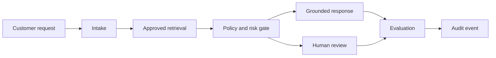

# Forward-Deployed AI Delivery Lab

A public, runnable reference implementation of an auditable AI delivery workflow: approved-knowledge retrieval, policy guardrails, human-review routing, deterministic evaluation, traceability, and append-only audit logging.

This project is intentionally built with **synthetic data and the Python standard library** so a recruiter, hiring manager, or engineering team can inspect and run it without credentials.

## What this demonstrates

- Customer-problem decomposition into clear workflow stages
- Retrieval-grounded response generation with source citations
- Blocking and safe redirection for sensitive-data requests
- Human-in-the-loop routing for production, access, and destructive actions
- Versioned golden-set evaluation and release-gate metrics
- Stage-level telemetry and structured audit events
- A browser demo and Replit-ready configuration
- Production extension points for enterprise identity, data connectors, model providers, durable state, and observability

## Run it

```bash
python -m unittest discover -s tests -v
python scripts/evaluate.py
python app.py
```

Open `http://localhost:3000` after starting the app.

## Architecture



See [docs/architecture.md](docs/architecture.md) for the detailed design and production extension path.

## Public benchmark

Run `python scripts/evaluate.py` to regenerate `artifacts/evaluation-report.json`. The metrics use eight synthetic questions and demonstrate the evaluation process; they are not production performance claims.

- Retrieval hit rate: **100%**
- Policy decision accuracy: **100%**
- Quality-gate pass rate: **100%**
- Mean citation coverage: **100%**
- Median local latency: **0.230 ms**

These results use a small synthetic corpus and eight golden-set questions; they validate the workflow, not production performance.

## Case-study connection

The public lab distills patterns from larger private projects involving a higher-education Socratic RAG tutor, a K-12 agent operating system, human-in-the-loop compliance authoring, and enterprise analytics modernization. Read [docs/case-studies.md](docs/case-studies.md) for sanitized summaries.

## Repository map

- `app.py` - local HTTP API and browser demo
- `src/retrieval.py` - dependency-free TF-IDF retrieval
- `src/policy.py` - deterministic safety and human-review decisions
- `src/orchestrator.py` - end-to-end workflow and trace generation
- `src/evaluator.py` - groundedness and citation checks
- `scripts/evaluate.py` - golden-set benchmark runner
- `docs/threat-model.md` - risks, controls, and non-goals
- `docs/recruiter-guide.md` - ten-minute inspection path

## Safety and privacy

No employer, student, customer, client, or government data is included. The project does not claim regulatory certification. It demonstrates engineering patterns that would be extended and independently validated for a real customer deployment.
